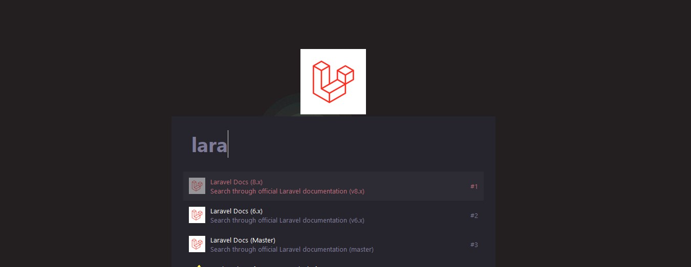

# Keypirinha Plugin: laravel-search-docs

This is laravel-search-docs, a plugin for the
[Keypirinha](http://keypirinha.com) launcher.

With this package you can search through official 
Laravel documentation (https://laravel.com/docs/).

## Download

https://github.com/emaia/keypirinha-laravel-search-docs/releases/latest

## Install

Once the `laravel-search-docs.keypirinha-package` file is installed,
move it to the `InstalledPackage` folder located at:

* `Keypirinha\portable\Profile\InstalledPackages` in **Portable mode**
* **Or** `%APPDATA%\Keypirinha\InstalledPackages` in **Installed mode** (the
  final path would look like
  `C:\Users\%USERNAME%\AppData\Roaming\Keypirinha\InstalledPackages`)

## Usage

  

Start typing "Laravel" then select version with TAB. Next type the search term...

## Change Log

### v1.0

* First release

## License

This package is distributed under the terms of the MIT license.

## Contribute

1. Check for open issues or open a fresh issue to start a discussion around a
   feature idea or a bug.
2. Fork this repository on GitHub to start making your changes to the **dev**
   branch.
3. Send a pull request.
4. Add yourself to the *Contributors* section below (or create it if needed)!
